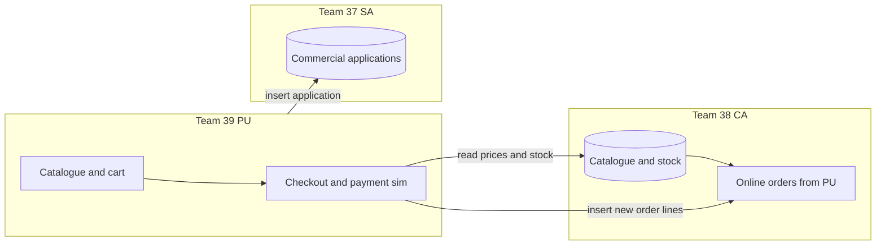

# Integration roles — who does what (Team 39 + 37 + 38)

This document is written so **you can skim the section with your team name** and know your job.  
Everyone uses the **same MySQL server** (e.g. Aden’s). Integration means: **the right tables exist**, **the right app reads/writes them**, and **product IDs match everywhere**.

---

## Start here (30 seconds)

| Team | Subsystem | In one sentence |
|------|-----------|-----------------|
| **39** | **PU** (your team) | Public shop, cart, checkout, promotions, PU members — **you** replace “fake CA/SA” code with **real database reads/writes** once the others name the tables. |
| **38** | **CA** | Pharmacy back office — **they** own **stock and catalogue** and **what happens when an online order arrives** from PU. |
| **37** | **SA** | Supplier / accounts side — **they** own where **commercial membership applications** from PU are stored and processed. |

**Your team is not “waiting forever.”** You need **written answers** from 38 and 37 (table names + columns). Until then you keep using mocks. After they answer, **you** wire the Java code to those tables.

---

## Big picture: how data flows

*If the diagram does not render: PU reads catalogue from CA → after pay, PU writes order to CA → PU writes commercial signup to SA.*

- **PU → CA:** PU must **read** catalogue/stock from CA’s data. After a successful payment, PU must **tell CA** “here is an order” (insert into a table they define, or equivalent).  
- **PU → SA:** PU must **insert** commercial signup data into a table SA defines (or SA reads from a queue you both agree on).

---

# Team 39 — PU — **your** checklist

Do these in order.

### Already done (don’t redo)

- [x] App connects to MySQL using `db.properties.local` (password not in Git).
- [x] Shop, cart, checkout, campaigns, reports work **using PU’s own tables** and **mock** CA/SA for now.

### You do next

1. **Send this file** to Team 38 and Team 37 and ask them to complete **their** sections below (table names + column names).
2. **Host a short meeting** (or WhatsApp thread) and agree:
   - **Product IDs** — one style for everyone (e.g. same strings in CA catalogue and in PU campaigns).
   - **Order ID** — PU already generates ids like `ORD-XXXXXXXX`; CA must say “yes, use that” or “we generate id Y and you store it.”
3. **Change the Java code** when you have their answers:
   - Replace `MockInventoryApiClient` with a class that **SELECT**s their catalogue and **INSERT**s into their order table(s).
   - Replace `MockMemberApiClient` with a class that **INSERT**s into SA’s application table.
4. **Test with CA:** place one order → CA confirms stock went down and order appears on their side.
5. **Test with SA:** submit one commercial application → SA confirms a row appears for them.
6. **Optional:** stop auto-running `schema.sql` on every app start against the **shared** server if your lecturer/DBA says it risks wiping shared data — agree as a group.

### What you give the other teams (copy-paste to them)

- “We need **table/view names** and **column names** for: (1) catalogue + stock, (2) where PU posts an online order, (3) where we read order status, (4) where we insert commercial applications.”
- “We send **after payment**: order id, delivery address, list of `product_id` + `quantity`, and optionally customer email if you want it.”
- “We send **commercial signup**: company reg no, director, business type, address, email (and company name if you add a field for us).”
- “Our DB user is **\_\_\_\_\_** (e.g. `pu_user`) — please **GRANT** only what we need.”

---

# Team 38 — CA — **their** checklist

**They** fill in the blanks and reply to Team 39.

### They must provide (written)

| # | They tell PU | Example of what you’re asking for |
|---|----------------|-----------------------------------|
| 1 | **Name of table or view** PU uses for the **shop catalogue** (product id, name, price, stock, …) | e.g. `v_pu_catalogue` or `ca_products` |
| 2 | **Column names** for each field PU needs (see technical box below) | `sku`, `title`, … |
| 3 | **Name of table(s)** where PU **writes a new online order** after payment | e.g. `pu_online_order` + `pu_online_order_line` |
| 4 | **How** CA processes that row (manual, job, trigger) | Their problem — PU only needs to know **success/failure** if possible |
| 5 | **Where** PU reads **order status** (`RECEIVED` / `DISPATCHED` / `DELIVERED` / `VOID`) | Same table or another view; keyed by **order id** |
| 6 | **MySQL permissions** for PU’s user | `SELECT` on catalogue; `INSERT` on order tables; `SELECT` on status |

### They must do (implementation)

- Create or expose those tables/views.
- Process PU orders so **stock** and **their** order records stay correct.
- Confirm **product IDs** match what PU puts in campaigns and cart.

### Technical box — fields PU reads for each product (CA maps columns)

| PU needs | Meaning |
|----------|---------|
| Product ID | Same string in cart and campaigns |
| Name | Shown in shop |
| Description | Can be empty |
| Retail price | Number |
| Stock quantity | How many available (same unit CA uses) |

**CA writes here:**

| PU field | Your column name: _______________ |
|----------|-------------------------------------|
| Product ID | |
| Name | |
| Description | |
| Retail price | |
| Stock quantity | |

**Catalogue table/view name:** _________________________________

**Order header + lines table names:** _________________________________

**Status read from (table/view + how to match order id):** _________________________________

---

# Team 37 — SA — **their** checklist

**They** fill in the blanks and reply to Team 39.

### They must provide (written)

| # | They tell PU |
|---|----------------|
| 1 | **Table name** (or queue) where **commercial applications** from PU are inserted |
| 2 | **Column list** matching what PU sends (see below) |
| 3 | **Rules** for duplicates (same email twice — reject, update, or ignore) |
| 4 | **Status values** if they use them (`SUBMITTED`, `APPROVED`, …) |
| 5 | **MySQL permission** for PU’s user — usually `INSERT` only |

### They must do (implementation)

- Create the intake table (or view for reporting).
- Make sure their admin side or process **sees** new rows from PU.

### Data PU sends today (SA maps columns)

| Content | Notes |
|---------|--------|
| Company registration number | Validated format in PU |
| Director name | |
| Business type | |
| Address | One line in form today |
| Email | |
| Submitted time | PU can set automatically |

**Optional:** If SA needs **company trading name** (e.g. “Pond Pharmacy”), they ask PU to add one form field and one column — agree together.

**SA writes here:**

| PU data | Your column name: _______________ |
|---------|-------------------------------------|
| Company reg no | |
| Director | |
| Business type | |
| Address | |
| Email | |
| Submitted at | |

**Intake table name:** _________________________________

---

# When all blanks are filled — PU closes the loop

| Step | Who |
|------|-----|
| Implement JDBC in new classes (replace `MockInventoryApiClient`, `MockMemberApiClient`) | **Team 39** |
| Run one checkout + one commercial signup on shared DB | **Team 39 + 38 + 37** together |
| Fix mismatches (wrong column, wrong product id) | **Everyone** |

---

# DBA / Aden — permissions cheat sheet

Whoever manages MySQL grants should ensure PU’s user can:

- **Read** CA catalogue object(s).
- **Insert** (and only if agreed, **update**) CA online-order object(s).
- **Read** CA order status for tracking.
- **Insert** SA commercial intake table.
- **Not** drop or alter CA/SA objects unless the whole group runs a migration.

PU keeps full control of **PU-only** tables: `users`, `orders`, `order_items`, `payments`, `campaigns`, `campaign_items`, `campaign_metrics`, `email_outbox`, `app_config`, and today `commercial_applications` **unless** SA replaces that with their own table only.

---

# Decisions to agree in the group chat

Reply with one line each:

1. One **product ID** scheme for the whole demo: _____________________  
2. Order id: **PU-generated** `ORD-…` OK for CA? **Yes / No** — if No, what id? _____________________  
3. On shared server, should PU **stop** auto-running `schema.sql` every launch? **Yes / No** _____________________  
4. Should guest checkout **email** be stored on CA’s order row? **Yes / No** _____________________  

---

**Related:** `docs/GROUP_API_CONTRACT_TEAM37_38_39.md` (what each method *means*).  
**Config:** `src/main/resources/db.properties.info` — no passwords in Git.  
**CA handoff:** `docs/TEAM39_TO_CA_HANDOFF.md`  
**SA handoff:** `docs/TEAM39_TO_SA_HANDOFF.md`  
**Integration tests:** `docs/SHARED_DB_INTEGRATION_TEST_PLAN.md`

**Maintained by:** Team 39 (PU). Update this file when CA/SA return their filled-in sections.
