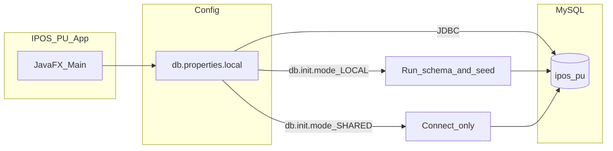

# IPOS-PU — project status, sample-data scenarios, and runbook

Single reference for **Team 39**: what is done, what is left, how to run the app, how to connect to MySQL, and how **IPOS_SampleData_2026.pdf** scenarios map to tests in this subsystem.

**Related docs (detail / SQL snippets):**

- [DEMO_CHEATSHEET_ONE_PAGE.md](DEMO_CHEATSHEET_ONE_PAGE.md) — one-page demo steps and queries  
- [SHARED_DB_INTEGRATION_TEST_PLAN.md](SHARED_DB_INTEGRATION_TEST_PLAN.md) — CA/SA integration tests after mocks are replaced  
- [TEAM39_TO_CA_HANDOFF.md](TEAM39_TO_CA_HANDOFF.md) / [TEAM39_TO_SA_HANDOFF.md](TEAM39_TO_SA_HANDOFF.md) — what to send other teams  
- [GROUP_SHARED_DB_CONTRACT_TEAM39.md](GROUP_SHARED_DB_CONTRACT_TEAM39.md) — roles and blanks for CA/SA  
- [db.properties.info](../src/main/resources/db.properties.info) — connection template (no passwords)

---

## 1. Current progress (IPOS-PU standalone)

These capabilities are implemented in the JavaFX app and backed by the PU MySQL schema (when you use **LOCAL** init or a DB that already has schema + seed).

| Area | Status |
|------|--------|
| Login | Email **or** PDF-style username (`PU0001`, `PU0002`, `sysdba`, `manager`) via `login_alias` |
| Sample PU users | Seeded: `cool@example.com` / `cool1@example.com`, admins `sysdba@ipos.local` / `manager@ipos.local` (PDF passwords) |
| Guest checkout | Continue as guest; checkout without member account |
| Catalogue | PDF-aligned ids; **`products.retail_price`** = customer price (PDF package cost × (1 + `retail_markup_percent`/100) × (1 + `vat_rate`/100), default **100%** markup + **0%** VAT → **2×** package cost); stock = PDF availability; see **`RetailPricing`** + **`app_config`** |
| Cart, search, promotions UI | Keyword search; Promotions tab; campaign discounts on lines |
| Campaigns (admin) | Create / update / cancel / terminate / delete; overlap protection |
| Seeded campaigns | **March Promotion** and **April Promotion** (PDF scenarios 17–18 dates and discount lines) |
| Checkout & payment | Simulated card validation; `payments` audit; order + `order_items` |
| Tracking | Email + tracking code lookup; confirmation text in `email_outbox` |
| Loyalty | Non-commercial 10% on every **10th** completed order (`User.isEligibleForLoyaltyDiscount`) |
| Scenario 20 seed | `cool@example.com` has `completed_order_count = 8` (next checkout = 9th; no loyalty until 10th) |
| Commercial application | Validation (incl. PDF-style UK company reg); handoff today via mock → `commercial_applications`; Pond Pharmacy sample row seeded |
| Reports | Sales, campaign, engagement + print |
| Shared DB safety | `db.init.mode=SHARED` skips auto `schema.sql` / `seed.sql` on startup (recommended for Railway) |
| Cross-team integration | **CA:** **`db.inventory.api=ca`** → shop + checkout use **`getCatalogue()`** / stock / orders on **`ipos_ca.Inventory`** (+ PU order tables). **SA:** still **`MockMemberApiClient`** until wired |

**Rough progress (same spirit as [FINAL_SHARED_DB_DELIVERY_CHECKLIST.md](FINAL_SHARED_DB_DELIVERY_CHECKLIST.md)):**

- Standalone PU features: **~90%**
- Cross-team integration: **~55%** until real CA/SA JDBC (or HTTP) adapters ship

---

## 2. Steps left (Team 39 + group)

1. **Get written answers from Team 38 (CA)** — catalogue view/table, online-order tables, status read model, `pu_user` grants ([TEAM39_TO_CA_HANDOFF.md](TEAM39_TO_CA_HANDOFF.md)).
2. **Get written answers from Team 37 (SA)** — commercial intake table + columns + duplicate rules + grants ([TEAM39_TO_SA_HANDOFF.md](TEAM39_TO_SA_HANDOFF.md)).
3. **Agree canonical product ids** across PU and CA (PDF uses `100 00001` style; DB uses `10000001` without spaces).
4. **Replace mocks** in code — `OrderService` / registration path: real `I_InventoryAPI` and `I_MemberAPI` implementations.
5. **Order status sync** — PU reads CA-agreed status for tracking (today mock stays `RECEIVED`).
6. **Shared DB** — keep `db.init.mode=SHARED` on Railway; run migrations/seeds only via agreed DBA process, not on every app launch.
7. **Optional** — if marking requires **PU0003** as a full “commercial member account”, extend schema/UI; today PU0003 is represented as a **commercial application** row only.
8. **Docs** — refresh [PROFESSOR_MARKING_SHEET_DEMO_RUNBOOK.md](PROFESSOR_MARKING_SHEET_DEMO_RUNBOOK.md) if it still references old demo accounts (`admin@ipos.local`, `P1001`, etc.).

---

## 3. Tests vs IPOS_SampleData_2026.pdf scenarios

The PDF mixes **SA**, **CA**, and **PU** data and stories. Below: what you can **verify in PU only** vs what needs **other subsystems** or **integration**.

### 3.1 PU-only or PU-primary (run in app + optional SQL)

| PDF ref | What to test | How (summary) | Expected result |
|---------|----------------|-----------------|-----------------|
| PU logins (`sysdba`, `manager`) | Admin access | Log in with `sysdba` / `masterkey` or `manager` / `GetPU_it_done` (or emails `sysdba@ipos.local` / `manager@ipos.local`) | Admin tab enabled |
| PU0001 / PU0002 | Member login | `PU0001` + `12ss_56_SS` or `cool@example.com`; `PU0002` + `34pp_78_LL` or `cool1@example.com` | Session opens; profile shows member |
| Scenario 17 | March Promotion | Open Promotions; confirm campaign name, dates, items (Aspirin, Analgin, Celebrex 100mg, Retin-A) | Discount lines match seed; products exist |
| Scenario 18 | April Promotion | Open Promotions; Ospen + Vitamin C | Same |
| Scenario 19 (PU slice) | Guest + promo + pay | Continue as guest; add e.g. Aspirin + Retin-A; valid card; future `MM/YY` | Order succeeds; `orders`, `payments`, `email_outbox` rows; stock reduced in **local** `products` |
| Scenario 20 (PU slice) | PU0001 ninth order / loyalty | Log in as PU0001; optional Ospen checkout; or `UPDATE users SET completed_order_count = 9` then checkout for 10th-order loyalty | 9th: no loyalty discount; 10th: 10% on order total |
| PU0003 sample | Commercial row | Query `commercial_applications` for `pondPharma@example.com` | Row with UK reg normalised; **not** a separate login account unless you extend the model |
| VAT / markup (sample sheet + brief) | N/A on PU cart beyond config | `app_config`: `retail_markup_percent` = 100, `vat_rate` = 0; CA JDBC catalogue uses **`RetailPricing`** on `Package_cost` | No extra CA columns |

Use [DEMO_CHEATSHEET_ONE_PAGE.md](DEMO_CHEATSHEET_ONE_PAGE.md) for exact SQL snippets.

### 3.2 Not verifiable in PU alone (CA / SA / cross-team)

| PDF scenarios / items | Why |
|-------------------------|-----|
| 1–6, 8–16 (SA merchant orders, CA shop sales, payments, debtors, reminders, etc.) | Belong to **IPOS-SA** and **IPOS-CA** applications and data |
| 7 (HelloPharmacy payments narrative) | SA accounts |
| Full end-to-end “Peter Popov” email as real SMTP | PU uses **simulated** `email_outbox` |
| Order lifecycle beyond PU’s local `RECEIVED` with real CA | Needs integration ([SHARED_DB_INTEGRATION_TEST_PLAN.md](SHARED_DB_INTEGRATION_TEST_PLAN.md)) |

After CA/SA integration, run the steps in [SHARED_DB_INTEGRATION_TEST_PLAN.md](SHARED_DB_INTEGRATION_TEST_PLAN.md) and add joint SQL checks on CA/SA objects.

---

## 4. How to connect to the database

### 4.1 App connection (`db.properties.local`)

1. Copy the template from [db.properties.info](../src/main/resources/db.properties.info).
2. Create **`src/main/resources/db.properties.local`** (gitignored — never commit passwords).
3. Choose **Option A** (Aden-style host/port) or **Option B** (full JDBC URL).

**Option A example shape (replace placeholders; password from team chat):**

```properties
db.host=<HOST>
db.port=<PORT>
db.name=ipos_pu
db.username=<USERNAME>
db.password=<PASSWORD>
db.init.mode=SHARED
```

**Option B example shape:**

```properties
db.url=jdbc:mysql://<HOST>:<PORT>/ipos_pu?allowPublicKeyRetrieval=true&useSSL=false&serverTimezone=UTC
db.username=<USERNAME>
db.password=<PASSWORD>
db.init.mode=SHARED
```

**Init mode:**

| Value | Behaviour |
|-------|-----------|
| `SHARED` | Connect only — **no** automatic `schema.sql` / `seed.sql` on startup (use on Railway / shared MySQL). |
| `LOCAL` | Run `schema.sql` + `seed.sql` on first connection (use on **your own** disposable MySQL or when intentionally reseeding). |

If `db.init.mode` is omitted, the app defaults to **LOCAL** for `localhost` / SQLite URLs and **SHARED** for other hosts.

**Environment variables (optional):** `IPOS_DB_URL`, `IPOS_DB_USERNAME`, `IPOS_DB_PASSWORD`, `IPOS_DB_INIT_MODE`.

### 4.2 CLI / Workbench

Use the same **host**, **port**, **database name**, and **user** as in `db.properties.local`. Password is never stored in Git.

Example CLI pattern (from [DEMO_CHEATSHEET_ONE_PAGE.md](DEMO_CHEATSHEET_ONE_PAGE.md)):

```powershell
mysql -h <HOST> -P <PORT> -u <USERNAME> -p
```

```sql
USE ipos_pu;
```

---

## 5. How to run the program

From the **`IPOS-PU`** folder:

```powershell
cd "d:\Year2\TERM 2\TEAM MODULE\TheProject\IPOS-PU"
.\mvnw.cmd javafx:run
```

**Compile (no tests):**

```powershell
.\mvnw.cmd -DskipTests compile
```

**Unit tests:**

```powershell
.\mvnw.cmd test
```

### Clean PDF-aligned dataset (local / disposable DB only)

1. Set `db.init.mode=LOCAL` in `db.properties.local`.
2. Run [reset.sql](../src/main/resources/db/reset.sql) against `ipos_pu` (truncates PU tables).
3. Restart the app so `schema.sql` + `seed.sql` run again.

**Do not** run `reset.sql` on the shared Railway DB without team agreement.

---

## 6. Configuration flow (diagram)



---

## 7. Quick links

| Document | Use for |
|----------|---------|
| [DEMO_CHEATSHEET_ONE_PAGE.md](DEMO_CHEATSHEET_ONE_PAGE.md) | Live demo script + SQL |
| [FINAL_SHARED_DB_DELIVERY_CHECKLIST.md](FINAL_SHARED_DB_DELIVERY_CHECKLIST.md) | Full delivery checklist |
| [SHARED_DB_INTEGRATION_TEST_PLAN.md](SHARED_DB_INTEGRATION_TEST_PLAN.md) | Post-integration tests with CA/SA |
| [GROUP_API_CONTRACT_TEAM37_38_39.md](GROUP_API_CONTRACT_TEAM37_38_39.md) | Frozen interface semantics |

---

*Maintained by Team 39 (IPOS-PU). Update progress percentages when integration closes.*
