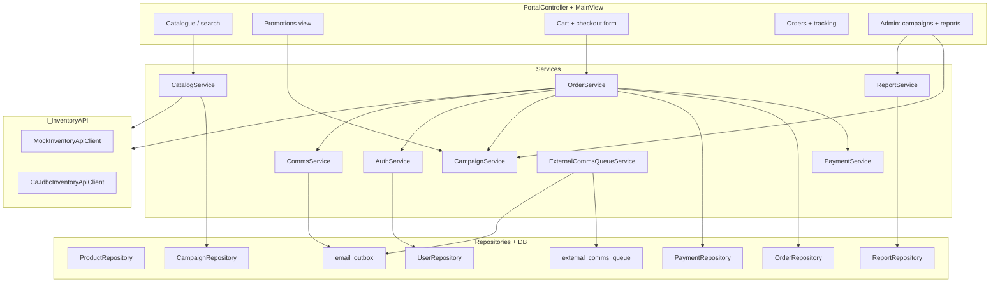

# IPOS-PU — Key components and how they work together

This sheet maps the **whole program** at a practical level: major packages, what each part does, and how flows connect for **catalogue**, **cart**, **orders**, **payments**, **reports**, **printing**, **campaigns**, **auth**, and **integrations**. For deeper schema and policy detail, see [PROJECT_OVERVIEW.md](PROJECT_OVERVIEW.md).

---

## 1. Big picture

| Layer | Location | Role |
|--------|----------|------|
| **Entry & lifecycle** | `Main.java` | Opens the JavaFX `Stage`, loads `MainView.fxml`, applies `app.css`, opens the DB connection before `launch()`, closes it in `stop()`. |
| **UI (single main surface)** | `MainView.fxml`, `app.css` | Tabbed portal: auth, catalogue, cart/checkout, orders, promotions, admin (campaigns + reports), profile. |
| **UI logic** | `PortalController.java` | Binds FXML controls, runs async `Task`s for JDBC-heavy work, calls services, refreshes tables/lists, handles reports and **print** job setup. |
| **Use cases** | `services/*` | Business rules: checkout orchestration, auth, catalogue, campaigns, payments, reports, email, external queue drain. |
| **SQL** | `repositories/*` | Parameterised JDBC per table area (`users`, `orders`, `campaigns`, `payments`, etc.). |
| **External systems (shared DB)** | `integrations/*`, `config/*Factory` | **CA** inventory (`CaJdbcInventoryApiClient`) or **local mock** (`MockInventoryApiClient`); **SA** commercial intake (`SaJdbcMemberApiClient`). Selected by config, not by scattered `if` in checkout. |
| **Cross-cutting** | `utils/*`, `mail/*` | Connections (`DatabaseManager`), pricing (`RetailPricing`), printing layout (`ReportPrintLayout`), passwords, date ranges, SMTP dispatch. |
| **Persistence definition** | `resources/db/schema.sql`, `seed.sql` | PU schema when `db.init.mode=LOCAL`; shared alignment via `shared_align_sample_data.sql`. |

`LoginView.fxml` / `LoginController` exist but the **live** sign-in and registration UX live in **`MainView.fxml` + `PortalController`** (auth panes swapped with the main `TabPane`).

---

## 2. How major features connect (one diagram)

---

## 3. Application bootstrap and configuration

| Piece | What it does |
|--------|----------------|
| **`Main.java`** | Fails fast if the database cannot be reached; then starts JavaFX so the user never lands on a broken UI without a connection attempt. |
| **`DatabaseManager.java`** | Reads `db.properties.local` (and env overrides), creates JDBC connections, runs **LOCAL** vs **SHARED** init (schema/seed vs light alignment). |
| **`InventoryApiFactory` / `MemberApiFactory`** | Instantiate **`I_InventoryAPI`** and **`I_MemberAPI`** from properties (e.g. mock vs CA JDBC). Checkout and catalogue always talk to the **interface**. |
| **`module-info.java`** | Declares JavaFX and SQL module requires; **opens** controller packages to FXML; **exports** `utils` for printing helpers used from the controller layer. |

Together, this means **one** checkout path in `OrderService` can drive either **local mock stock** or **CA-backed** catalogue and fulfilment tables.

---

## 4. Authentication, guest mode, and registration

| Component | Responsibility |
|-----------|------------------|
| **`PortalController`** | Shows auth `VBox` vs `TabPane`, handles login, guest continue, non-commercial and commercial registration panes, forced password change, status copy button for temp passwords. |
| **`AuthService`** | `login` → `UserRepository.authenticate` (hash / legacy plaintext sample users); `registerNonCommercial`; `forcePasswordChange`; `ensureGuestCheckoutUser`; validates commercial DTO fields. |
| **`UserRepository`** | CRUD-style access to `users` (credentials, `member_type`, `completed_order_count`, `first_login_required`, optional `login_alias`). |
| **`CommsService`** | After registration, persists welcome email via **`CommsRepository`** → `email_outbox` (+ optional SMTP). |
| **`SaJdbcMemberApiClient` + `MemberApiFactory`** | Validated commercial applications insert into **SA** intake tables for downstream review. |

**Guest checkout:** `OrderService` uses `AuthService.ensureGuestCheckoutUser()` so `orders.user_id` always references a real `users` row even when the shopper never registers.

---

## 5. Catalogue and promotions (browsing)

| Piece | How it works |
|--------|----------------|
| **`CatalogService`** | **Mock mode:** `ProductRepository` SQL against PU `products` + keyword filter. **CA mode:** `I_InventoryAPI.getCatalogue()` then **in-memory** keyword filter; prices come from CA cost + **`RetailPricing`** + **`AppConfigRepository`** (markup/VAT). **`LegacySampleProductIds`** dedupes duplicate display names. |
| **`CampaignRepository` / `CampaignService`** | Active campaigns expose per-product discount %; **`CatalogService.activeDiscounts()`** feeds the UI so card prices reflect promotions. |
| **`PortalController`** | Renders catalogue cards from `InventoryItemDto`; search and “Promotions” navigation call into `CatalogService` / `CampaignService`; opening promotions triggers **`recordPromotionsView()`** (engagement metrics). |

Catalogue **display** is therefore: **inventory API** (source of truth for SKUs/stock/CA pricing) **plus** **campaign** overlays from PU tables.

---

## 6. Cart, pricing, and campaign metrics (before payment)

| Piece | Role |
|--------|------|
| **`CartItem` / `InventoryItemDto`** | Session line: product id, qty, unit price, discount % snapshot used at checkout. |
| **`PortalController`** | Adds lines; on add, **`CampaignService.recordItemAdded(productId, qty)`** updates **`campaign_metrics`**-style counters for reporting. |
| **`OrderService.calculateCartTotal`** | Sums line totals; if `User.isEligibleForLoyaltyDiscount()` (non-commercial, every 10th completed order), applies **10%** off the basket. |

Cart math is **UI-driven state** validated again inside **`OrderService.checkout`**.

---

## 7. Checkout: stock, payment, orders, inventory, email (core pipeline)

`OrderService.checkout(...)` is the **single orchestration** for a paid order:

1. **Validate** email, address, payment payload, non-empty cart.  
2. **`I_InventoryAPI.reserveOrReject`** — optimistic stock feasibility (mock: transactional row updates; CA: parallel rules in client).  
3. **`calculateCartTotal`** — includes loyalty.  
4. **`PaymentService.processPayment`** — implements **`I_PaymentAPI`**: validates card metadata/expiry, returns synthetic success/failure (**no real PSP**).  
5. On payment failure: persist failed **`payments`** row, return message.  
6. On success: **`submitOnlineOrder`** — mock decrements PU `products`; CA path writes CA online order tables and stock in coordination with PU.  
7. **`OrderRepository.createOrderWithItems`** — inserts **`orders`** / **`order_items`** with price/discount snapshots and tracking id.  
8. **`PaymentRepository.savePayment`** — links payment to `order_id`.  
9. **`CampaignService.recordItemPurchased`** per line — **purchase** metrics for reports.  
10. **`AuthService.incrementCompletedOrders`** for registered users (loyalty progression).  
11. **`CommsService.sendOrderConfirmation`** — outbox email with order id + tracking.

So: **catalogue/stock** come from **`I_InventoryAPI`**, **money simulation** from **`PaymentService`**, **PU legal record** from **`OrderRepository`**, **promotion analytics** from **`CampaignService`**, **loyalty** from **`AuthService`/`User`**, **customer notice** from **`CommsService`**.

---

## 8. Order history and tracking

| Piece | Behaviour |
|--------|-----------|
| **`OrderService.getOrderHistory`** | Loads PU orders by user; if CA inventory enabled, **`mergeCaStatusOntoOrder`** overlays status from **`I_InventoryAPI.getOrderStatus`**. |
| **`findOrderByTracking`** | Normalises email + code; used for **guest** and **member** lookup from the Orders tab. |
| **`OrderRepository`** | Queries `orders` / joins as needed for listing and tracking. |

---

## 9. Admin: campaigns (create, adjust, cancel, metrics)

| Piece | Responsibility |
|--------|------------------|
| **`CampaignService`** | Parses admin **item spec** text into product ids + discount %; **`CampaignRepository`** enforces **no overlapping active campaign** on the same product in the same window; create/update/cancel/terminate/delete; **`recordPromotionsView` / `recordItemAdded` / `recordItemPurchased`** for funnel metrics. |
| **`PortalController`** | Admin tab: tables for campaigns/preview, dialogs/async tasks calling `CampaignService`. |

Reports (below) **read** the same `campaigns` / `campaign_metrics` / order data that checkout **writes**.

---

## 10. Admin: reports on screen and printing

| Step | Component |
|------|-----------|
| Date range | **`ReportDateRange`**, `PortalController.resolveReportWindow()` from `DatePicker`s. |
| Aggregations | **`ReportService`** → **`ReportRepository`**: **sales**, **campaign**, **engagement** SQL for the window. |
| On-screen table | **`loadReport`** builds dynamic `TableColumn`s from the first row’s keys; rows wrapped as **`MapRow`**. |
| Print | **`onPrintReport`**: `PrinterJob`, A4 `PageLayout`, **`ReportPrintLayout.buildPrintableRoot`** (title, period, grid of values within printable width), **`print-report.css`**, then **`job.printPage(pageLayout, printRoot)`**. |

Screen and print share the **same** in-memory row set (via column keys + `MapRow.toMap()`), so “what you generated” is what you print.

---

## 11. Communications (email trail and CA/SA ingress)

| Piece | Role |
|--------|------|
| **`CommsRepository`** | Inserts into **`email_outbox`** first, then **`SmtpOutboxDispatcher`** (if mail enabled) — **persistence before SMTP**. |
| **`MailConfig` / `mail.properties`** | SMTP endpoints and behaviour. |
| **`ExternalCommsQueueService`** | Poll-driven (from **`PortalController`** `Timeline` ~45s): moves **`external_comms_queue`** rows into **`email_outbox`** with a provenance footer, marks **`consumed_at`**. |

This ties **PU-originated** mail and **cross-subsystem** notifications into one **auditable** outbox model.

---

## 12. Payments (simulation only)

| Piece | Notes |
|--------|--------|
| **`PaymentService`** | Card type, PAN fragments, expiry `MM/yy` vs current date; returns **`PaymentResult`** with synthetic transaction id on success. |
| **`PaymentRepository`** | Stores rows in **`payments`** for success and some failure paths. |
| **`PaymentRequest` / `PaymentResult`** | DTOs between UI → service → repo. |

There is **no** live PayPal/card capture in this codebase; it is deliberately **module-safe** and testable (`PaymentServiceTest`).

---

## 13. Integration clients (CA / SA)

| Client | Contract (`api/*`) | Typical use |
|--------|---------------------|-------------|
| **`MockInventoryApiClient`** | `I_InventoryAPI` | Local demo: `ProductRepository`, transactional stock. |
| **`CaJdbcInventoryApiClient`** | `I_InventoryAPI` | Shared DB: read **CA** inventory, write **`pu_online_order`** lines, read back **order status** for PU UI. |
| **`SaJdbcMemberApiClient`** | `I_MemberAPI` | Insert commercial membership **intake** for SA workflow. |

**`RetailPricing` + `AppConfigRepository`** bridge CA package cost to **customer-facing unit prices** when CA mode is on.

---

## 14. Models, DTOs, and tests

| Area | Files (representative) |
|------|-------------------------|
| **Domain models** | `User`, `Order`, `Product`, `CartItem` — session and display helpers (`User` includes loyalty flag). |
| **DTOs** | `CartLineDto`, `OnlineOrderRequest`/`Result`, `InventoryItemDto`, `PaymentRequest`/`PaymentResult`, `OrderStatusDto`, queue DTOs — stable shapes across layers. |
| **Tests** | Under `src/test/java`: **services** (`OrderService`, `AuthService`, `PaymentService`), **models** (`User`), **utils** (`SecurityUtil`, `RetailPricing`, `ReportDateRange`). JavaFX flows are manual. |

---

## 15. File index by concern (quick lookup)

| Concern | Primary files |
|---------|----------------|
| **FXML / CSS** | `resources/com/teesolutions/ipospu/views/MainView.fxml`, `LoginView.fxml`, `app.css` |
| **Controller** | `PortalController.java` (most behaviour), `LoginController.java` (stub) |
| **Checkout** | `OrderService.java`, `I_InventoryAPI.java`, integrations, `OrderRepository`, `PaymentService`, `PaymentRepository` |
| **Catalogue** | `CatalogService.java`, `ProductRepository.java`, `LegacySampleProductIds.java` |
| **Campaigns** | `CampaignService.java`, `CampaignRepository.java` |
| **Reports** | `ReportService.java`, `ReportRepository.java`, `ReportPrintLayout.java`, `print-report.css` |
| **Auth / users** | `AuthService.java`, `UserRepository.java`, `PasswordUtil.java`, `SecurityUtil.java` |
| **Email** | `CommsService.java`, `CommsRepository.java`, `ExternalCommsQueueService.java`, `mail/SmtpOutboxDispatcher.java` |
| **DB bootstrap** | `DatabaseManager.java`, `resources/db/*.sql`, `db.properties.local` |

---

## 16. Closing: how “everything” achieves the brief

- **Catalogue** = inventory API + optional CA pricing + PU campaign discounts + UI cards in **`PortalController`**.  
- **Stored orders** = **`orders` / `order_items`** via **`OrderRepository`**, after stock and payment steps succeed.  
- **Payments** = **`PaymentService`** simulation + **`payments`** table audit.  
- **Admin reports** = **`ReportService`/`ReportRepository`** over orders + campaign metrics.  
- **Print** = same report data → **`ReportPrintLayout`** + JavaFX **`PrinterJob`**.  
- **Campaigns** = **`CampaignService`/`CampaignRepository`** for lifecycle + rules; **metrics** fed from promotions view, add-to-cart, and successful checkout.  
- **Together** = **`PortalController`** wires user events to services; services compose **repositories + integration APIs + mail** so PU stays the portal of record while **CA/SA** participate through **shared schemas** and **factories**.

---

*Update this sheet when you add new tabs, APIs, or persistence tables so it stays a reliable map of the program.*
